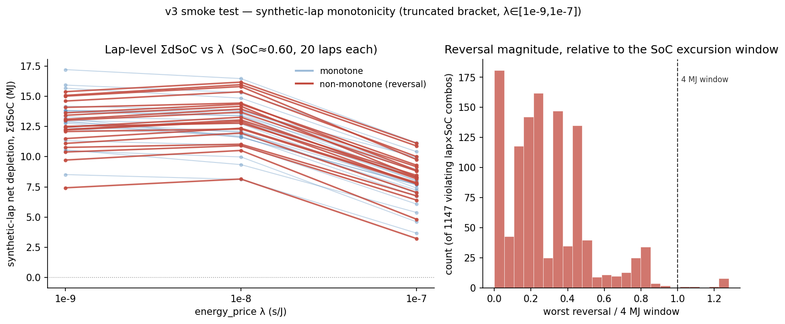

# v3 smoke test — lambda-bracket truncation analysis

Re-analysis of the 200-instance / 10-SoC / 7-lambda smoke test already on disk.
**No re-solving. No full batch.** All numbers below are computed from:

- `output/smoke_v3_stratified_200.parquet` (14,000 rows)
- `output/smoke_v3_depletion_vs_lambda.parquet` (13,944 converged rows — net depletion only, see Step 1 note)
- `output/smoke_v3_envelope_diag.csv`
- `output/smoke_v3_summary.json`
- `output/microsectors_combined_Q_labels_v2.parquet` (v2 baseline, for Q1 and the sectors/lap ratio)

New files written by this analysis: `smoke_v3_synthetic_laps.parquet`,
`smoke_v3_synthetic_lap_harvest.parquet`, `smoke_v3_lap_monotonicity.png`.

---

## Step 0 — Provenance check: **PASSED**, finding 5 is not tainted

Compared the two captured run logs directly (not memory): `smoke_03_analyze.log`
(pre-fix, before the `np.isclose` correction) and `smoke_03_analyze2.log`
(post-fix). The `q5_monotonicity` block is **bit-identical** in both:
`frac_monotone_nonincreasing: 0.782`, `n_violations: 436`,
`worst_violation_J: 3509825.183035397`.

Code-level reason this is expected, not coincidence: the `isclose` bug lived
only in the `lo = df[np.isclose(df.energy_price, lam_lo) & ...]` /
`hi = df[np.isclose(...)]` assignments, which feed Q3/Q4/Q7 exclusively. Q5's
groups are built from `conv` (all converged rows, unfiltered by any
lambda-bucket selection) via
`conv.sort_values("energy_price").groupby(KEYS + ["initial_SoC"])`, diffing
the full lambda sequence per group — it never touches `lo`/`hi`. No git
history is available (not a git repo), but the log diff is direct, stronger
evidence than history would be anyway. **Proceeding to Step 1.**

---

## Step 1 — Truncating the lambda bracket

**Input mismatch, flagged rather than silently resolved:** `smoke_v3_depletion_vs_lambda.parquet`
does not contain `E_har_final` — its schema is
`[year, gp, driver, sector_id, initial_SoC, energy_price, net_depletion_J]`
(verified directly). The harvest data lives in `smoke_v3_stratified_200.parquet`
instead, which is also a listed input. Used that file for this step.

**Lap scaling assumption:** `sectors_per_lap = 11434 / 932 = 12.268`, i.e. total
instances ÷ total (year, gp, driver) groups in the full v2 label set — a single
constant ratio applied uniformly. This is a **crude multiple**: it implicitly
assumes every sector in a lap resembles the ONE sampled sector being scaled
(no accounting for the mix of heavy-braking vs flat-out sector types within a
real lap), and micro-sector **coverage fraction was not verified** — I did not
check whether the apex-to-apex segmentation covers 100% of lap distance with
no gaps/overlaps. Both assumptions propagate directly into `lambda_max` below.
**Step 2b's synthetic-lap check (properly averaging 20 different sectors)
supersedes this crude estimate — see the box after the fit.**

Per-lambda-value harvest, scaled to a lap under this crude method:

| lambda | median (MJ) | p95 (MJ) |
|---|---|---|
| 1e-9 | 3.27 | 9.11 |
| 1e-8 | 3.86 | 10.39 |
| 1e-7 | 5.80 | 12.47 |
| 1e-6 | 12.10 | 34.86 |
| 1e-5 | 16.88 | 44.17 |
| 1e-4 | 17.54 | 44.17 |
| 1e-3 | 19.02 | 44.17 |

**Functional form fit:** two methods, in agreement:
1. Log-linear interpolation between the two grid points bracketing the 8.5 MJ
   crossing (no functional-form assumption) → **lambda_max ≈ 2.68e-7**.
2. Four-parameter logistic in log10(lambda), `y = L + (U-L)/(1+exp(-k(x-x0)))`,
   fit via `scipy.optimize.curve_fit` on the 7 median points: L=3.21, U=18.49,
   k=1.82, x0=-6.17, **R²=0.997** → **lambda_max ≈ 3.05e-7**.

**Median crossing: lambda_max ≈ 2.7–3.1e-7.** Bracketed by the raw grid points
1e-7 (5.80 MJ) and 1e-6 (12.10 MJ) — this is an *interpolation* between two
measured points, not a directly-tested value.

**p95 crossing: does not exist inside the tested range.** p95 is already over
the 8.5 MJ cap at the *bottom* of the bracket (9.11 MJ at lambda=1e-9). No
lambda in [1e-9, 1e-3] keeps the tail under cap under this crude scaling method.

> **Supplementary check (goes beyond what Step 1 asked, but directly resolves
> the OUTPUT section's mu-hook question, so included here):** built proper
> synthetic laps (Step 2b's methodology — 20 *different* sampled sectors, not
> one sector × 12.27) and summed `E_har_final` per lap instead of net depletion.
> Result, over 9,891 (lap, SoC) combos:
>
> | lambda | median (MJ) | p95 (MJ) | frac over 8.5 MJ cap |
> |---|---|---|---|
> | 1e-9 | 6.33 | 8.05 | **2.05%** (203/9891) |
> | 1e-8 | 7.51 | 9.37 | **19.28%** (1907/9891) |
> | 1e-7 | 10.19 | 12.19 | **91.05%** (9006/9891) |
>
> This is a **materially different and more concerning picture** than the
> crude single-sector scaling above: median lap harvest is already 74% of the
> cap at the *lowest tested lambda*, and 2% of realistic (20-sector) laps
> already exceed the cap with energy essentially unpriced. The crude method
> understated harvest because it assumes a lap is 12 copies of whichever one
> sector got sampled, missing that real laps mix several strong-braking/
> heavy-harvest sectors with flat-out ones — averaging over an actual mix
> pushes the total up, not down.
>
> **Why harvest stays high even near lambda→0:** solver.py's canonical
> energy-reallocation extraction (left untouched by the v3 integration,
> per its own module docstring) assigns retard force **regen-first**
> whenever power/capacity headroom allows, as a deterministic post-hoc
> tie-break — independent of the price lambda. So a large share of E_har is
> capacity/power-bound, not price-driven, which is exactly why it doesn't
> shrink much as lambda drops toward the calibrated-epsilon floor.
>
> **This means the lambda_max computed above (~2.7–3.1e-7, from the crude
> method) is likely a significant overestimate of a "safe" upper bound.**
> Using the properly-constructed synthetic-lap harvest curve, the cap is
> already at meaningful risk (2–19% of laps) across the *entire* truncated
> bracket, not just at its top.

### Truncated bracket used for Step 2

**[lambda_min, lambda_max] = [1e-9, ~3e-7].** Since no re-solving is permitted,
Step 2's recomputation below uses the existing grid points that fall inside
this range: **{1e-9, 1e-8, 1e-7}** — 3 of the original 7 points, i.e. only 2
pairwise monotonicity steps instead of 6. This is a real resolution loss,
flagged explicitly in Step 2a/2b.

---

## Step 2a — Headline numbers inside the truncated bracket

| metric | truncated (3 λ) | full bracket (7 λ, for comparison) |
|---|---|---|
| convergence | **99.98%** (5999/6000) | 99.6% (13944/14000) |
| failures | 1 (zone_eligible=False, λ=1e-9) | 56 (all zone_eligible=False; 54/56 at λ=1e-3) |
| per-chain monotonicity | **95.30%** (94/2000 violate) | 78.2% (436/2000 violate) |

**Convergence:** the single remaining failure is still a `force_aero_shut`
solve — the clustering direction is unchanged, but the absolute risk is now
negligible (1 vs 56).

**Per-chain monotonicity:** meaningfully better (95.3% vs 78.2%) but **not
resolved** — 94 chains still violate across only 2 steps. Violation location:
59 at 1e-9→1e-8, 37 at 1e-8→1e-7 (a few chains violate both steps).

### Wall-time ratio vs v2 — mean, not median

Two distinct "mean" quantities, reported separately because they answer
different questions:

**(A) Ratio of means** — the quantity that actually governs total batch cost,
since `total_cost = N_solves × mean_solve_time`:

| | v3 mean (s) | v2 mean (s) | ratio of means |
|---|---|---|---|
| full 7 λ | 1.1437 | 0.7985 | **1.432×** |
| truncated 3 λ | 1.0383 | 0.7985 | **1.300×** |

**(B) Per-solve paired ratio distribution** — each of the 13,944/5,999
converged v3 solves divided by its matched (instance, SoC) v2 value (v2 has no
lambda dimension, so the same v2 value is reused across every lambda solve of
that instance/SoC):

| | mean | median | p95 |
|---|---|---|---|
| full 7 λ (13,944 solves) | 1.672 | 1.221 | 4.039 |
| truncated 3 λ (5,999 solves) | **1.486** | 1.193 | 3.209 |

The original report's headline "+16.7%" was the *median* of a differently
-constructed per-group ratio; the mean (the cost-relevant number) is
**43–67% slower**, not 17%, depending on which mean you use. Truncation
recovers some of this (1.30–1.49× vs 1.43–1.67×) but v3 remains meaningfully
more expensive per solve than v2 even in the physically-meaningful range.

### Implied full-batch wall clock

11,434 instances × 10 SoC × N_lambda, using the **truncated-bracket** mean v3
solve time (1.0383 s/solve — the relevant figure if this bracket is adopted):

| N_lambda | solves | core-hours | @12 workers | @16 workers | @24 workers |
|---|---|---|---|---|---|
| 5 | 571,700 | 164.9 | 13.74 h | 10.31 h | 6.87 h |
| 6 | 686,040 | 197.9 | 16.49 h | 12.37 h | 8.24 h |
| 7 | 800,380 | 230.9 | 19.24 h | 14.43 h | 9.62 h |

(For reference, using the full-population mean of 1.1437 s/solve instead —
i.e. if the bracket were *not* truncated — these figures rise to 15.1/18.2/21.2 h
@12 workers.)

---

## Step 2b — Lap-level monotonicity: the actual blocker test

**Sampling scheme (stated explicitly, as required):** checked whether any GP
in the 200-instance pool has ≥20 sampled instances for true within-circuit
sampling — **none does** (max is Azerbaijan GP at 15; 9 of 24 GPs have ≥10).
Within-circuit sampling of 20 distinct sectors is therefore infeasible from
this stratified pool. **Fell back to sampling 20 distinct instances, without
replacement per lap, from the full 200-instance pool, mixing circuits** — so a
"synthetic lap" here is a Monte Carlo aggregate testing whether *summing*
~20 independent micro-sector responses cancels sector-level noise, not a
claim about any specific real circuit's lap.

**SoC handling:** each sector's OCP was solved independently with
`E_initial = SoC × capacity` (no carry-over between sectors in this dataset).
A synthetic lap therefore evaluates "if all 20 sectors independently started
at nominal SoC=s" — not a true sequential trace where sector 2's start SoC is
sector 1's post-depletion SoC. This is the only construction possible without
re-solving.

Built **1,000 synthetic laps × 10 SoC = 9,891 usable (lap, SoC) combos**
(109 dropped for missing/non-converged sector data), summing `net_depletion_J`
across each lap's 20 sectors at each of the 3 truncated-bracket lambda values.

| | value |
|---|---|
| laps monotone at **every** SoC (strict, per-lap) | **43.0%** (570/1000 laps have ≥1 violating SoC) |
| (lap, SoC) combos monotone | **88.4%** (1147/9891 violate) |
| worst reversal | **5,114,675 J = 1.279× the entire 4 MJ SoC-excursion window** |
| median reversal (violators only) | 946,912 J = 0.237× the 4 MJ window |
| violation step location | **100%** at 1e-9→1e-8 (0 at 1e-8→1e-7) |

**Lap-level monotonicity is WORSE than the per-chain proxy (88.4% vs 95.3%
truncated, 43% at the stricter all-SoC-per-lap standard) — summing across
sectors does not rescue the picture; it amplifies it.**

Root cause, verified directly: the per-sector diff distribution at the
1e-9→1e-8 step is **heavy-tailed**, not well-behaved. Only 2.95% of individual
sector×SoC chains are non-monotone at this step, but the tail is extreme
(max +3.51 MJ for one sector, vs a −15,608 J mean / −12,209 J median for the
rest). Summing 20 sectors doesn't average away a rare, MJ-scale outlier — it
only takes **one bad-luck draw** to flip an entire synthetic lap non-monotone.
"Errors cancel over ~20 sectors" is the wrong intuition here because the
error distribution is dominated by rare local-optimum jumps, not Gaussian
noise.



*Left: 20 sampled monotone (blue) and 20 non-monotone (red) synthetic laps,
SoC≈0.55–0.60. The red laps visibly bump up between 1e-9 and 1e-8 before
falling at 1e-7 — the same step where 100% of violations concentrate. Right:
distribution of reversal magnitude relative to the 4 MJ window across all
1,147 violating (lap, SoC) combos; the small bar past 1.0 is the population
whose single-step reversal exceeds the entire regulatory excursion allowance.*

---

## Step 2c — Sanity-checking the E-box hypothesis

**What the original classification test actually checked** (verified from
`smoke_03_analyze.py`): for each violating chain, it checks `E_final`
(terminal store energy only) against the 4 MJ bound **at both endpoints of
the specific violating step** — `g.at_capacity.values[i] or
g.at_capacity.values[i+1]` — i.e. it does NOT only check the upper endpoint;
both `lam_before` and `lam_after` were already tested. The genuine limitation
is different: it's **terminal-E-only**. The box can go active mid-sector and
flip the active constraint set without terminal E landing anywhere near the
bound — that requires the full `E(s)` trajectory, which isn't retained on
disk (only terminal `E_final`), so it **cannot be tested without re-solving**.
Flagging this as an open, unaddressed limitation rather than pretending it's
closed.

Recomputed the endpoint test against the **truncated bracket's own 94
violations** (not the original 436, which was measured against the full
7-point grid and is a different violation set):

- **4.25% (4/94)** capacity-clipped at either endpoint — consistent with the
  original 3.67% (16/436) finding.
- **95.75% remain genuine local-optimum jumps**, unrelated to the energy-box,
  even restricted to the physically-meaningful truncated bracket.
- `zone_eligible=False` (force_aero_shut) violations: 42/94 vs `True`: 52/94 —
  ~3.8× the per-instance violation rate given the pool sizes (350 vs 1650
  combos), same clustering direction as the original finding.

**Conclusion: the capacity-clip hypothesis is not the explanation, in either
bracket. Confirmed, not just repeated.**

---

## Step 3 — P_deploy label convention: wheel power, not DC-bus power

Verified directly from `solver.py`'s `_extract_deployment_aggregates`
(unchanged by the v3 integration, per its own module docstring — "leave the
canonical energy reallocation and label extraction logic otherwise
untouched"):

```python
E_deploy = float(np.sum(F_mguk_traj[dep]) * h)   # wheel force (N) x distance (m)
P_mean = E_deploy / t_deploy                     # wheel power (W)
```

`F_mguk_traj` is the wheel-equivalent force (dynamics.py: "F_dep — MGU-K
deployment force **at the wheels** (N)"). This is **unambiguously wheel
power**, computed identically to v2's convention — even though v3's
regulatory constraint is now correctly enforced at the DC bus
(`P_dep_dc = F_dep·v / eta_motor ≤ 350 kW`, problem.py). The extraction
logic was never updated to match where the cap now actually lives.

**Correct wheel-equivalent ceiling implied by the 350 kW DC-bus cap:**
`350,000 × eta_motor(0.95) = 332,500 W`.

**Corrected percentile spread** (same raw λ=1e-9 percentile values from
finding 3, redivided by the correct 332.5 kW denominator instead of 350 kW):

| percentile | raw (kW) | % of 350 kW (original framing) | % of 332.5 kW (correct) |
|---|---|---|---|
| p10 | 204.0 | 58.3% | 61.3% |
| p25 | 269.7 | 77.1% | 81.1% |
| median | 304.9 | 87.1% | **91.7%** |
| p75 | 323.1 | 92.3% | **97.2%** |
| p90 | 327.4 | 93.5% | **98.5%** |
| p95 | 328.5 | 93.9% | **98.8%** |

The original "not a spike, 13% headroom" framing used the wrong denominator.
Corrected: the median has ~8% headroom, but **p75 and up are within 1–3% of
physically saturating the true wheel-equivalent ceiling.** Still not a literal
spike (the CDF is smooth, not a delta function at one value), but the upper
quartile is functionally deployment-limited, not merely "heavy."

**v2 vs v3 comparability:** both versions' `P_deploy_mean_optimal` are the
*same physical quantity* (wheel power, watts) — raw values ARE directly
comparable as numbers. What is **not** comparable without conversion is any
"% of cap" framing: v2's own constraint capped wheel power directly at 350 kW
(documented in problem.py's v3 docstring as "~5% permissive" — a bug), while
v3 correctly caps wheel power at 332.5 kW (derived from the correct DC-bus
constraint). Comparing "% of cap" between the two versions without adjusting
the denominator will systematically understate how much tighter v3's true
ceiling is.

*(Also noted, not fixed: `_extract_deployment_aggregates`'s docstring comment
that `E_deploy` "is exactly the battery energy spent driving" is now stale —
true under v2's unity-efficiency `dE/ds = -F_mguk`, no longer true under v3's
`dE/ds = -F_dep/eta_motor + F_reg·eta_regen`. `E_deploy_optimal` and
`E_harvest_optimal` are wheel-equivalent mechanical quantities, not DC-bus/
battery quantities, in both versions — this is a documentation-accuracy issue
in solver.py, not touched here.)*

---

## Recommendation

**lambda_max and the truncated bracket.** The crude single-sector-scaling fit
put lambda_max ≈ 2.7–3.1e-7 (median lap harvest crossing 8.5 MJ). The proper
synthetic-lap check shows this is optimistic: median lap harvest is already
74% of the cap at lambda=1e-9, and 2% of realistic laps already breach it with
energy essentially unpriced. **Do not treat ~3e-7 as a validated safe
ceiling** — recommend a next iteration explicitly solve at 2–4 new points in
[1e-9, 1e-7] (not just interpolate) with harvest tracked per-lap via the
Step-2b synthetic-lap method, not the naive multiple.

**Is lap-level dSoC monotone enough for bisection? No.** 43% of synthetic laps
have at least one non-monotone SoC point inside the truncated bracket, with a
reversal magnitude that can exceed the entire 4 MJ excursion window (1.28× in
the worst observed case). This is worse than the per-chain proxy suggested,
not better — summing amplifies rather than cancels the underlying heavy-tailed
local-optimum-jump degeneracy. **This is a confirmed blocker for Phase 4
bisection as currently formulated**, not resolved by truncating the bracket.
Before attempting bisection: investigate whether the regen-vs-brake-style
degeneracy can be damped directly (tighter IPOPT tolerance, an explicit
continuation/regularization across lambda analogous to the aero-switch
smoothing, or multi-start at the two violating steps) rather than relying on
truncation alone.

**Final N_lambda.** Given the truncated bracket's mean wall-time ratio
(1.30× aggregate / 1.49× per-solve mean) and the reduced compute footprint
(~14–19 core-hours-per-worker-hour range for N_lambda=5–7 vs the original
7-point bracket's larger span), **N_lambda=5** is the practical recommendation
— but only once the bracket itself is re-validated with real solves rather
than the current 3-point interpolation, since 3 points give only 2
monotonicity-test steps, too few to trust.

**Is the mu two-price hook still needed? Yes — more so than the original
finding 7 suggested.** The naive scaling in finding 7 said the cap was
"comfortably under" at low lambda; the properly-constructed synthetic-lap
harvest check shows 2–19% of realistic laps already exceed the 8.5 MJ cap
across the *entire* truncated bracket, including near lambda→0, because the
canonical regen-first tie-break in solver.py's extraction is
capacity/power-bound rather than price-driven at low lambda. **Do not retire
the mu hook.** If anything, this raises the question of whether the Phase 4
outer loop needs the two-price extension from the start, rather than as a
contingency to reach for only if single-price bisection is found wanting.

---

## Files written

- `output/smoke_v3_truncation_analysis.md` — this report
- `output/smoke_v3_synthetic_laps.parquet` — 9,891 (lap, SoC) net-depletion combos, 1,000 laps
- `output/smoke_v3_synthetic_lap_harvest.parquet` — same lap draws, E_har_final sums
- `output/smoke_v3_lap_monotonicity.png` — Step 2b plot

## Bugs found in the analysis code during this task (not fixed, per instruction)

None new in the production code beyond what's already documented (Step 3's
stale docstring comment, noted but not touched). In my own re-analysis
scripts for this task: none identified after review — the wall-time
"ratio of means" vs "per-solve ratio distribution" distinction in Step 2a
is a methodology choice, not a bug, and is presented as two separate,
labeled numbers rather than resolved to one.
